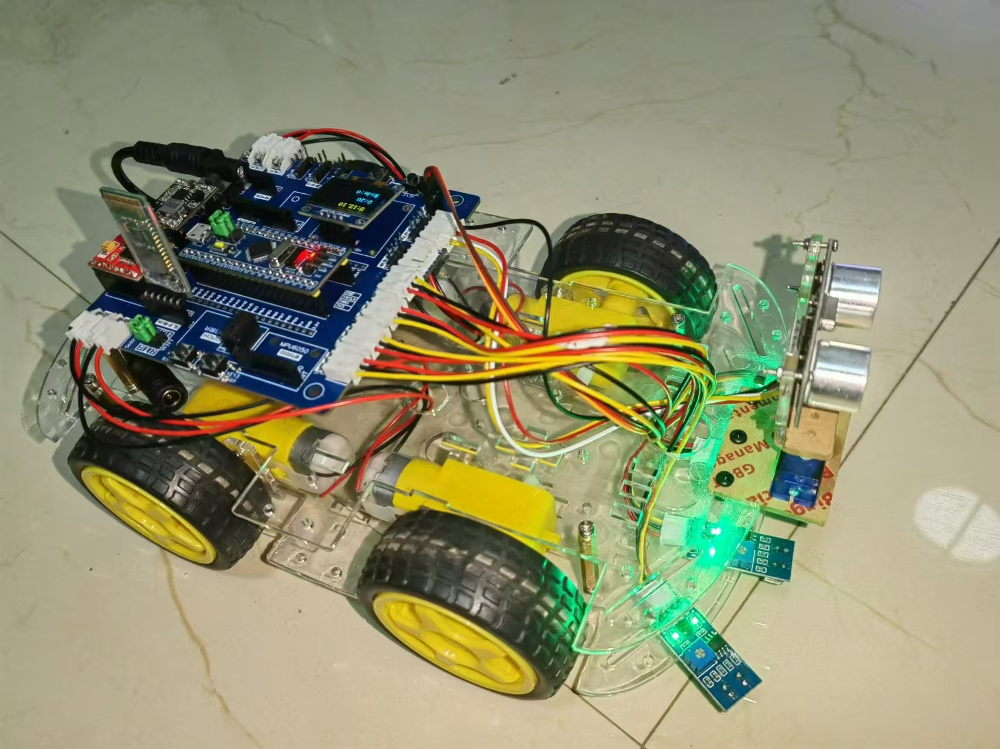
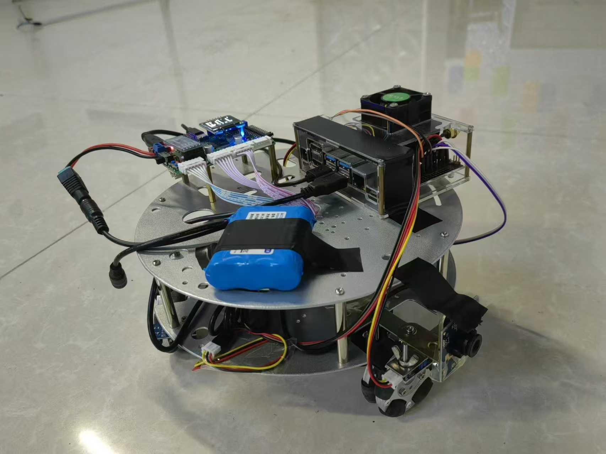
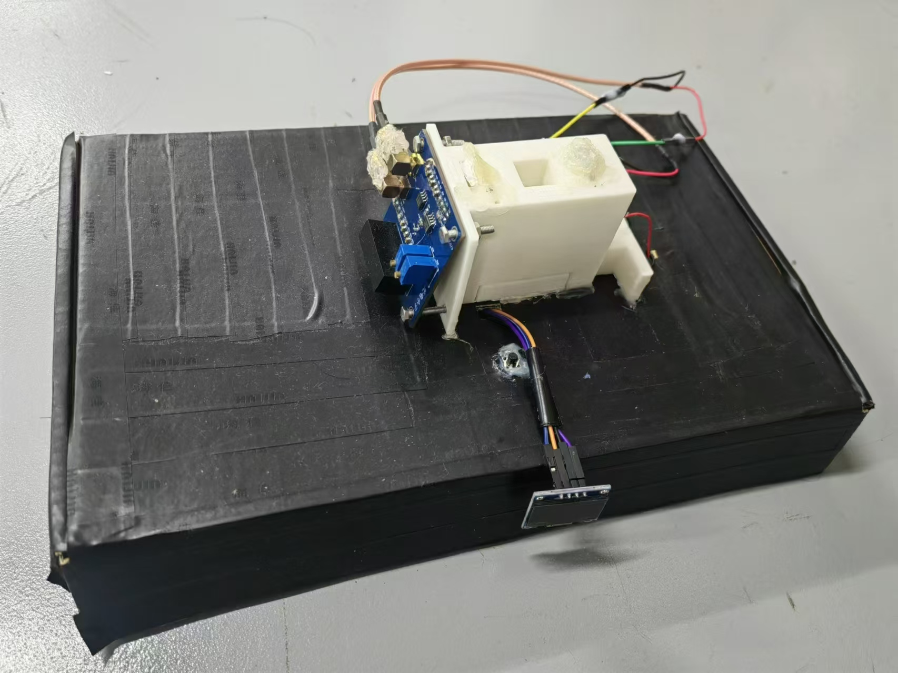
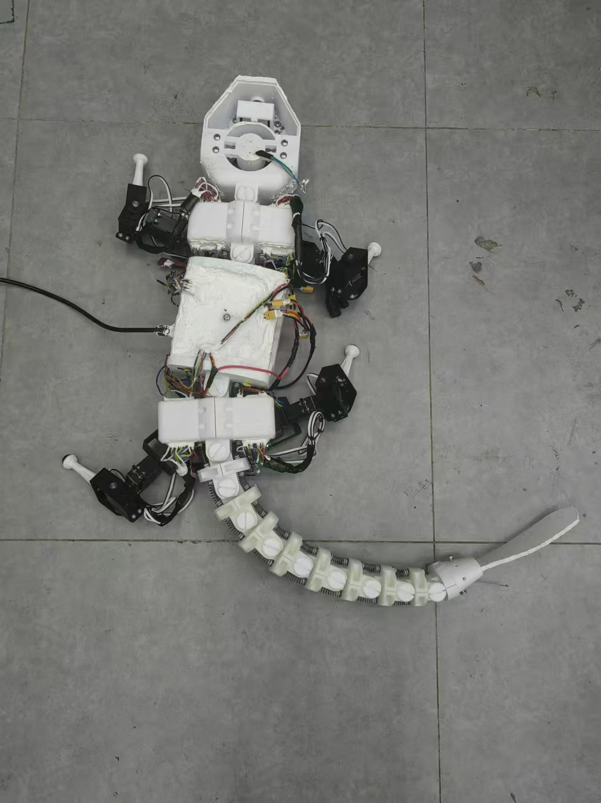
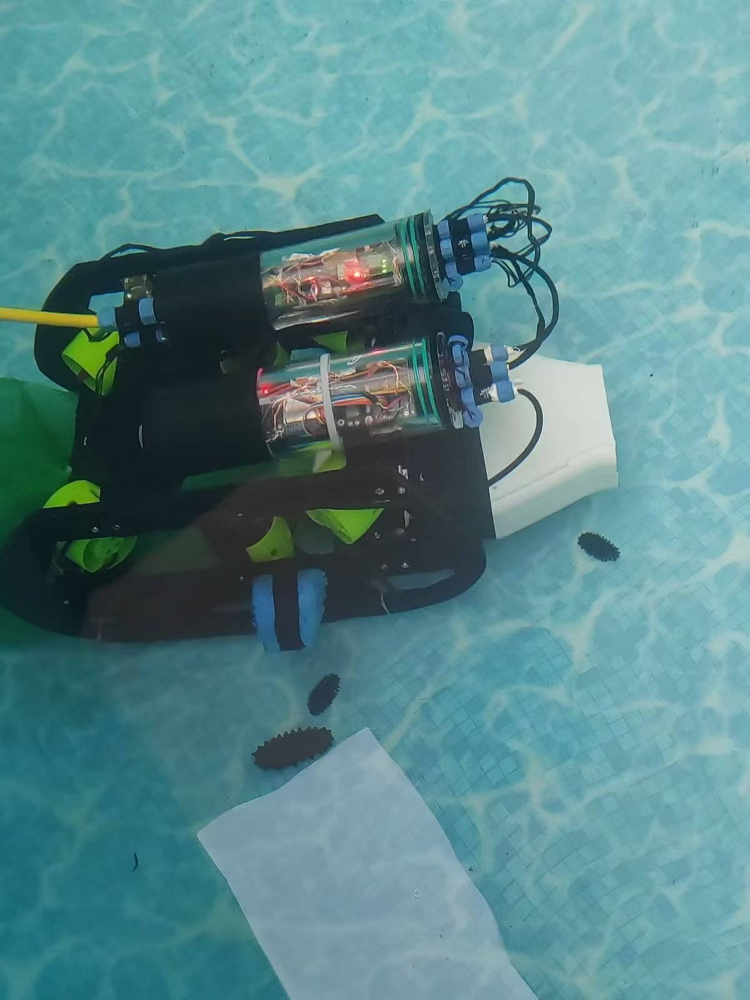
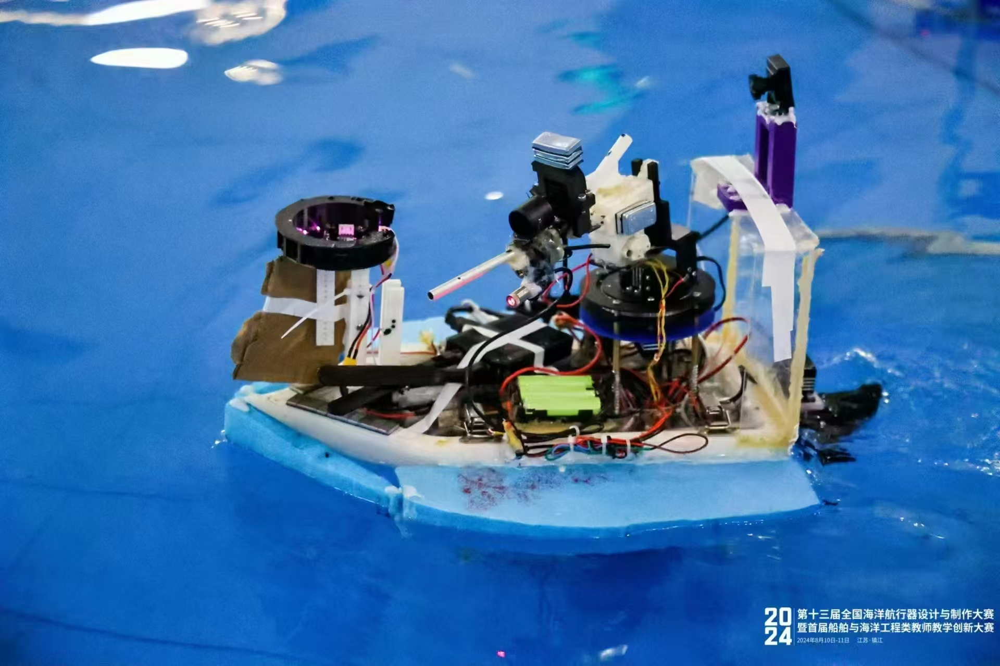
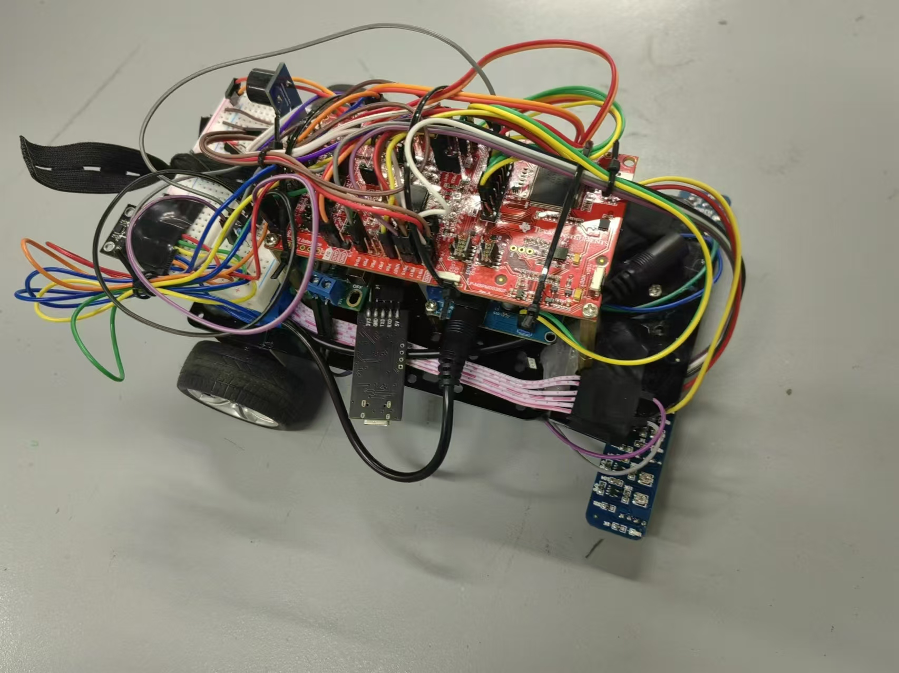

# My_Project_Records

- ## STM32小车

  
  - ### 时间：2022年寒假
  - ### 简介：
      这是本人的第一个项目，主要是用来学习STM32、熟悉PCB设计及焊接等技能。小车主要有以下功能：手机蓝牙遥控、红外寻迹、自动避障。
  - ### **本人所涉及技术**：
     STM32（!）、PCB设计、PCB焊接（!）、舵机驱动、TB6612控制直流电机、蓝牙串口通信、超声波避障模块、红外寻迹模块、电源树。
  
- ## 寻宝小车
  
  - ### 时间：2023年春节学期+暑假
  - ### 简介：
      本项目是为了准备全国大学生光电设计竞赛的赛题2“迷宫寻宝”光电智能小车而制作的。小车在比赛开始时，记录下迷宫的地图；在比赛过程中，小车在迷宫中寻找己方宝藏，若不小心找错了宝藏（敌方的or假的），则扣除相应的分数。分高用时少者获胜。
  - ### 本人所涉及技术：
     Jetson nano环境配置（!）、PID、Python（!）、STM32（!）、Opencv
    
- ## 酒精测量装置
  
  - ### 时间：2023年秋季学期
  - ### 简介：
      本项目是为了准备第六届山东省大学生光电设计科技创新大赛而制作的。装置通过检测穿过酒精后的红外光光强与穿过前的光强，做到无接触式测量酒精浓度。
  - ### 本人所涉及技术：
       Arduino（!）、电源树、文献阅读（!）。
- ## 两栖仿生机器人
  
  - ### 时间：2023秋季学期-2024暑假
  - ### 简介：
    **国创项目** 针对我国海岸线漫长，缺少相关人员管理的问题，本项目通过仿生海鬣蜥生物的外形、爬行步态以及尾部运动，制作一台运动灵活的水陆两栖爬行机器人，以完成岸边和近岸水域的巡逻。
  - ### 本人所涉及技术：
    爬行步态、机器人硬件系统、人员分工、进度规划、会议安排
- ## 海参捕捞机器人
  
  - ### 时间：2024年暑假
  - ### 简介：
    本项目是为了准备2024年全国大学生电子设计竞赛信息科技前沿专题赛而制作的。基于文丘里原理，我制作了一个海参吸捕装置，大大提高了捕捞海参的效率。
  - ### 本人所涉及技术：
    Fusion360、ROV通信系统（!）、水下机器人防水舱（!）、网线通信
- ## 无人船
   
  - ### 时间：2024年春季学期+暑假
  - ### 简介：
    本项目是针对全国大学生海洋航行器设计与制作大赛C2类而制作的无人船。无人船的功能主要包括：依据光电门自主巡航、自动识别打靶。
  - ### 本人所涉及技术：
    隔离电路（!）、PCB设计、PCB焊接、PCB_Debug（!）
- ## 惯导寻迹小车
  
  - ### 时间：2024年暑假
  - ### 简介：
    本项目是在2024年TI杯山东省大学生电子设计竞赛期间制作的，赛题为：H题。
  - ### 本人所涉及技术：
    IT板卡、PID、熬夜（!）

